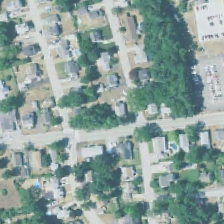

# Real World Scenario: Aerial Image Classification

## Introduction

This example demonstrates how to use Azure Machine Learning (AML) Workbench to coordinate distributed training and operationalization of image classification models. We use the [Microsoft Machine Learning for Apache Spark (MMLSpark)](https://github.com/Azure/mmlspark) package to featurize images using pretrained CNTK models and train classifiers using the derived features. We then apply the trained models in parallel fashion to large image sets in the cloud. These steps are performed on an [Azure HDInsight Spark](https://azure.microsoft.com/en-us/services/hdinsight/apache-spark/) cluster, allowing us to scale the speed of training and operationalization by adding or removing worker nodes.

The form of transfer learning we demonstrate has major advantages over retraining or fine-tuning a deep neural network: it does not require GPU compute, is fast and arbitrarily scalable, and fits fewer parameters than a dense neural network layer. This method is therefore an excellent choice when few training samples are available -- as is often the case for custom projects. Many users report that transfer learning produces highly performant models, allowing them to avoid deep neural networks trained from scratch at much greater cost.

## Prerequisites

- An [Azure account](https://azure.microsoft.com/en-us/free/) (free trials are available)
- An installed copy of [Azure Machine Learning Workbench](./overview-what-is-azure-ml.md)
    - Follow the [quick start installation guide](./quick-start-installation.md) to install the program and create a workspace
- An installed copy of [AzCopy](https://docs.microsoft.com/en-us/azure/storage/common/storage-use-azcopy), a free utility for coordinating file transfer between Azure storage accounts

This example was tested on a Windows 10 PC; you should be able to run it from any Windows machine, including Azure Data Science Virtual Machines. Minor modifications may be required (for example, changes to filepaths) when running this example on macOS.

## Use Case Description

In this scenario, we train deep neural networks (DNNs) to classify the type of land shown in aerial images of 224-meter x 224-meter plots. Land use classification models can be used to track urbanization, deforestation, loss of wetlands, and other major environmental trends using periodically collected aerial imagery. After training and validating the classifier model, we will apply it to aerial images spanning Middlesex County, MA -- home of Microsoft's New England Research & Development (NERD) Center -- to demonstrate how these models can be used to study trends in urban development.

To produce an image classifier using transfer learning, data scientists often construct multiple models with a range of methods and select the most performant model. Azure Machine Learning Workbench can help data scientists coordinate training across compute environments, track and compare the performance of multiple models, and apply a chosen model to large datasets on the cloud.

## Data Description

This scenario uses publicly available aerial imagery data from the [National Agriculture Imagery Program](https://www.fsa.usda.gov/programs-and-services/aerial-photography/imagery-programs/naip-imagery/) at 1-meter resolution. We have generated sets of 224 pixel x 224 pixel PNG files cropped from the original NAIP data and sorted according to land use labels from the [National Land Cover Database](https://www.mrlc.gov/nlcd2011.php). A sample image (label: developed) is shown:

Class-balanced sets of ~44k and 11k images are used for model training and validation, respectively. We demonstrate model deployment on an image set tiling Middlesex County, MA -- home of Microsoft's New England Research and Development (NERD) center. For more information on how these image sets were constructed, see the [Embarrassingly Parallel Image Classification git repository](https://github.com/Azure/Embarrassingly-Parallel-Image-Classification).

## Scenario Structure

Step-by-step instructions are provided on the [Microsoft DOCS site](https://github.com/MicrosoftDocs/azure-docs-pr/tree/release-ignite-aml-v2/articles/machine-learning/); a brief description of the workflow follows.

In this example, image data and pretrained models are housed in an Azure storage account. An Azure HDInsight Spark cluster reads these files and constructs an image classification model using MMLSpark. The trained model and its predictions are then written to the storage account, where they can be analyzed and visualized by a Jupyter notebook running locally. Azure Machine Learning Workbench coordinates remote execution of scripts on the Spark cluster. It also tracks accuracy metrics for multiple models trained using different methods, allowing the user to select the most performant model.

The [step-by-step instructions](https://github.com/MicrosoftDocs/azure-docs-pr/tree/release-ignite-aml-v2/articles/machine-learning/) begin by guiding you through the creation and preparation of an Azure storage account and Spark cluster, including data transfer and dependency installation. They then describe how to launch training jobs and compare the performance of the resulting models. Finally, they illustrate how to apply a chosen model to a large image set on the Spark cluster and analyze the prediction results locally.

## Conclusions and next steps

Azure Machine Learning Workbench helps data scientists easily deploy their code on remote compute targets. In this example, local code was deployed for remote execution on an HDInsight cluster. Azure Machine Learning Workbench's run history feature tracked the performance of multiple models and helped us identify the most accurate model. Workbench's Jupyter notebooks feature helped visualize our models' predictions in an interactive, graphical environment.

## References

- [The Embarrassingly Parallel Image Classification repository](https://github.com/Azure/Embarrassingly-Parallel-Image-Classification)
   - Describes dataset construction from freely available imagery and labels
- [MMLSpark](https://github.com/Azure/mmlspark) GitHub repository
   - Contains additional examples of model training and evaluation with MMLSpark

## Contact

Please feel free to contact Mary Wahl ([mawah@microsoft.com](mailto:mawah@microsoft.com)) with any questions or comments.

## Disclaimer

Leave this session as what it is for now. We update the content once we get more concrete answers from the legal team.